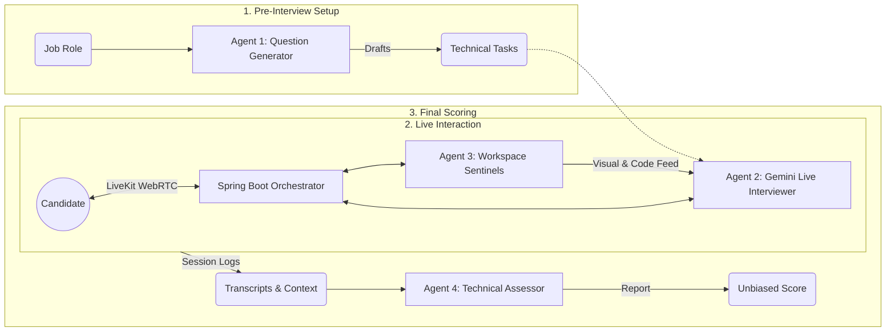

The current landscape of technical hiring is bottlenecked by a fundamental scalability problem. Organizations receiving hundreds of applications per role find it impossible to conduct live, high-quality interviews for every candidate, often resorting to cold, non-immersive recordings or static tests. These traditional "AI interviews" are neither live nor engaging—they strip away the conversational nuance that defines a great engineer and leave both the company and the candidate with a fragmented view of technical potential.

We built **Owlyn** to bridge this gap using real-time multimodal intelligence. Our goal was to create an **autonomous agent ecosystem** that isn't just an automated assessment, but a live, immersive collaborator. By leveraging the Gemini Live API, Owlyn conducts real-time technical interviews and provides an persistent assistant mode that can see, hear, and interact with sub-second latency. Every interaction is synchronized with live transcripts, ensuring the system is both high-fidelity and accessible across every workflow.

[Watch the Owlyn Demo on YouTube](https://www.youtube.com/watch?v=nEaLIrNk0uk&list=PL1BztTYDF-QPfrzXwoC_6OSLs818uAqN2&index=9)

> This piece of content was written by me, **Abdulrahmon Adenuga** (@Rahmannugar), along with **Akeem Adetunji** and **Mosimiloluwa Adebisi** and created for the purposes of entering the Google **#GeminiLiveAgentChallenge** hackathon. It covers how we built Owlyn using Google AI models and Google Cloud.

## Table of Contents
1. [The Core Objectives](#1-the-core-objectives)
2. [System Architecture](#2-system-architecture)
3. [The Multi-Agent Protocol](#3-the-multi-agent-protocol)
4. [Live Workflows: Interview, Monitoring, and Assistant](#4-live-workflows-interview-monitoring-and-assistant)
5. [Real-Time Multimodal Pipelines](#5-real-time-multimodal-pipelines)
6. [Security: The Sentinel Mode](#6-security-the-sentinel-mode)
7. [Engineering Decisions](#7-engineering-decisions)
8. [Closing Thoughts and Future Roadmap](#8-closing-thoughts-and-future-roadmap)

## 1. The Core Objectives
Existing AI interview tools often fail because they are built as wrappers around static LLMs, leading to two major deal-breakers: **hallucination** and **latency**. If an AI takes 5 seconds to respond, the conversation is dead. If it "guesses" what your code does instead of analyzing its logic, it loses all technical authority.

To solve this, we defined four design pillars for Owlyn:

*   **Zero-Latency**: Using Gemini Live to achieve sub-second response times, this eliminates the "awkward silence" typical of LLM-based bots, ensuring the conversation maintains the natural momentum of a real-world technical discussion.
*   **Multimodal Reasoning**: The agent must do more than listen; it must "see" the workspace. By streaming the screen feed, the agent can react to a candidate's cursor movements or a logic error in a whiteboard diagram.
*   **Inclusive Accessibility**: Building a system that is accessible to everyone. This means supporting multiple spoken languages and providing live transcripts for candidates with hearing disabilities, ensuring that automation doesn't come at the cost of inclusion.

## 2. System Architecture

Owlyn is designed as a distributed, real-time multimodal system composed of four major layers:

1. Electron Client Layer
2. Backend Orchestration Layer
3. Worker Agent Layer
4. Infrastructure & AI Layer

This separation allows the system to maintain sub-second conversational latency, while supporting multiple AI agents analyzing different signals simultaneously.

### 2.1 Electron Client Layer

The client application is built with Electron + React, which allows Owlyn to access system-level capabilities that are unavailable in the browser.

The Electron frontend is responsible for:
- Capturing camera, microphone, and screen feeds
- Rendering the Monaco coding workspace
- Streaming audio/video via WebRTC
- Sending application events to the backend via HTTPS REST

The client communicates with the backend in two ways:

**HTTPS / REST**
Used for:
- Authentication
- Session creation
- Interview configuration
- transcript synchronization

**LiveKit WebRTC**
Used for low-latency real-time streams:
- microphone audio
- webcam video
- workspace signals

These streams are routed to the backend orchestration layer and AI agents.

### 2.2 Backend Orchestration Layer

The backend is built using Spring Boot and acts as the central orchestrator of the entire system.

Rather than allowing each AI agent to independently connect to the client, all signals pass through the backend first. This ensures:
- consistent session state
- controlled AI communication
- centralized logging and monitoring

The backend exposes two internal interfaces:

**REST API**
Handles standard application workflows:
- interview creation
- candidate session management
- transcript storage
- session metadata

**Internal API**
Used for agent-to-agent communication and system orchestration.
This internal API connects to the Assessor Agent, which performs post-interview analysis and scoring.
### 2.3 Worker Agent Layer

Owlyn runs several specialized Python worker agents responsible for processing multimodal signals during a session.
These agents operate independently from the core backend to keep real-time processing lightweight.

**LiveKit Agent**
The LiveKit Agent connects to the LiveKit WebRTC stream and manages:
- real-time voice conversation
- audio streaming to Gemini Live
- returning AI responses to the candidate

This forms the primary conversational loop of the interview.

**Proctor Sentinel**
The Integrity Sentinel monitors the webcam feed to ensure the session remains secure.
Using Gemini Vision, it detects:
- unauthorized devices
- additional people in frame
- suspicious behavior
- environmental anomalies

Any violation is immediately flagged and logged.

**Workspace Sentinel**
The Workspace Sentinel observes the candidate’s coding environment, including:
- Monaco editor
- whiteboard interactions
- cursor behavior
- code structure

It continuously analyzes implementation logic and forwards observations to the Interviewer agent so the conversation can react to the candidate’s code in real time.

### 2.4 Infrastructure and AI Layer

The final layer provides the persistent infrastructure and AI services that power the system.

**PostgreSQL**
Used for durable storage of:
- interview sessions
- transcripts
- reports
- user data

PostgreSQL is accessed through the backend using JPA.

**Redis**
Redis stores live session state, including:
- transcript buffers
- agent context
- security flags
- active workspace data

This allows the system to perform sub-millisecond state updates during live conversations.

**LiveKit Server**
LiveKit acts as the real-time media backbone of Owlyn.
It manages:
- WebRTC signaling
- audio/video transport
- stream synchronization

This allows voice conversations to occur with sub-second latency, which is critical for maintaining natural dialogue.

**Gemini AI**
Owlyn integrates multiple Gemini models for specialized reasoning tasks:
- Gemini Live API → real-time voice conversation
- Gemini 3.1 Pro → deeper reasoning and evaluation
- Gemini 3 Flash → lightweight real-time inference
- Gemini Vision → visual analysis of the workspace and webcam
Each model powers a different agent in the system.

### 2.5 Cross-System Communication Flow

During a live interview session, the system operates as a continuous pipeline:

The Electron client streams audio/video via LiveKit.

The Spring Boot backend orchestrates session state.

Python agents process multimodal signals in parallel.

Signals are routed to Gemini AI models for reasoning.

Results are returned through LiveKit to the candidate in real time.

Redis stores live context while PostgreSQL stores persistent records.

This architecture allows Owlyn to maintain low latency, contextual awareness, and modular AI reasoning, enabling the system to behave less like a scripted bot and more like a real technical interviewer.

## 3. The Multi-Agent Protocol

Owlyn is built on a **decoupled multi-agent architecture**. We designed the system from the ground up using specialized Gemini instances for distinct tasks; voice interaction, workspace vision, and real-time code analysis rather than relying on a single monolithic agent. This ensures that the interviewer remains grounded by the candidate's actual workspace signals while maintaining sub-second conversational latency.

The **Orchestrator** is our server. Since Gemini agents can't directly talk to each other without a shared context, the Orchestrator acts as the central router. It receives video and audio via WebRTC, pipes them to the correct Gemini model, and then relays **context** between the different agents. This ensures the interviewer can react to a failing test case or a specific logic choice in real-time.
- **Agent 1: The Question Generator (Gemini 3 Flash Preview)**: This agent runs during the interview creation phase on the management dashboard. It analyzes the job role and requirement details to draft specific technical challenges and coding tasks. This ensures the interviewer (Agent 2) has a tailored set of objectives ready before the candidate even starts the session.
- **Agent 2: The Interviewer (Gemini Live)**: This is the conversational agent the candidate hears. It handles the voice loop with sub-second latency, maintaining a natural dialogue flow throughout the session.
- **Agent 3: The Sentinels (Gemini 3.1 Flash Lite)**: These are the specialized "eyes" and "ears" of the system.
  - **Integrity Sentinel**: Processes the video feed to monitor session security and detect unauthorized activity.
 - **Workspace Sentinel**: Observes the Monaco editor and whiteboard. It analyzes the implementation logic in real-time, providing deep structural insights to the interviewer.
- **Agent 4: The Technical Assessor (Gemini 3)**: Once the interview ends, this agent takes the full transcript and the logic reasoning logs to generate a structured JSON report. It looks purely at the data to give an unbiased score.

This "Agent-to-Agent" handoff is what makes Owlyn feel smart. When Agent 3 identifies a logic error in your code, it tells Agent 2: _"Hey, their solution might have a performance issue."_ Agent 2 then asks the candidate: _"I noticed your current approach might have some performance challenges. Can you walk me through your time complexity?"_

### Persona Customization: Defining the Interviewer
We built a **Persona Engine** to move away from a "one-size-fits-all" agent ecosystem. Recruiters can configure their agents' behavior through several technical levers in the management dashboard:
- **Linguistic Localization**: The spoken language can be set per session, supporting **English, German, Spanish, French**, and several other locales for a global candidate pool.
- **Behavioral Scalars**: Instead of basic prompts, we use weighted scores for **Empathy**, **Analytical Depth**, and **Directness**. These values are injected into the agent's core instructions to shift the tone from a supportive guide to a rigorous technical evaluator.

- **Document-Based Knowledge**: Recruiters can upload PDFs or DOCX files—such as internal engineering rubrics or company values—which the system parses and uses to inform the agent's specific technical knowledge during the session.

## 4. Live Workflows: Interview, Monitoring, and Assistant

We didn't just stop at an interview screen. We built four distinct ways to use Owlyn. Across all modes, we prioritized accessibility through **Live Transcripts**. For developers with hearing disabilities or those in noisy environments, Owlyn provides a threaded, real-time transcript of every word the agent says. This ensures the system remains inclusive and that the agent's logic can be read and reviewed as it happens.

### A. The Interview Workspace

This is the core experience. The candidate has a professional-grade workspace with the **Monaco Editor**, a canvas-based **Whiteboard**, and a **Notes** app. Everything is synced in real-time.

### Support for Multiple Programming Languages
We engineered the workspace to be language-agnostic. By utilizing **Monaco Editor** (the engine behind VS Code), Owlyn provides a native coding experience for over 20+ languages, including **Typescript, Python, Go, Java, and C++**. The Workspace Sentinel (Agent 3) is specifically tuned to understand the idiomatic nuances of these languages, ensuring that whether a candidate is writing a high-performance Go routine or a clean React component, the evaluation remains context-aware and accurate.

### B. Monitoring Mode

For organizations, visibility is just as important as the evaluation itself. We built a **Monitoring Dashboard** that serves as a real-time command center for recruitment teams. 

Hiring managers can join any active session as a "Silent Observer," gaining a comprehensive view of the candidate’s performance without interfering with the natural flow of the interview. The dashboard provides a live, rolling transcript, a synchronized audio waveform to visualize the conversation's cadence, and an instant alert system. If our sentinels detect a security anomaly—such as the presence of a mobile device or an unauthorized person in the frame—a flag is immediately raised on the recruiter's screen, allowing for instant intervention if necessary.

### C. Assistant Mode

Assistant Mode transforms Owlyn into a persistent multimodal companion for everyday development. Beyond the interview, this mode operates as a **floating widget** that lives alongside your IDE and terminal. 
- **Environmental Context**: The agent utilizes screen-share vision and your microphone to stay synchronized with your active tasks. 
- **Voice-First Interaction**: Leveraging the **LiveKit** protocol for sub-second responses, it acts as a senior pair-programmer you can talk to in real-time.
- **Ambient Assistance**: Whether you're debugging a complex stack trace or architecting a new service, the Assistant provides contextual insights based on exactly what it sees on your screen.

### D. Practice Mode

Before entering a real technical interview session, candidates need a way to test their technical skills and get comfortable with the interview environment. We built **Practice Mode** as a standalone version of the workspace where users define their own parameters:
- **Customizable Sessions**: Users input a specific topic (e.g., "React Performance" or "Distributed Systems") and set a difficulty and timer. The agent then dynamically generates a technical session based on those constraints.
- **Protocol Parity**: It uses the same multi-agent orchestration, audio/video streaming, and code analysis as the Enterprise mode. This ensures the candidate is getting the real experience in a private environment.

## 5. Real-Time Multimodal Pipelines

Capturing human interaction for an autonomous agent is technically demanding. We had to solve for two main things: data shape and latency.

For the **Video Feed**, we stream 1 frame per second. We found this to be the "sweet spot" for Gemini’s Vision capabilities—it’s enough to detect a phone or a change in gaze without destroying the candidate's upload bandwidth.

For **Audio**, we use 16kHz mono PCM. This is streamed up to our Java server, which then pipes it directly into the Gemini Live API via the **Google ADK**. We spent a lot of time on the `audio.service.ts` to ensure that audio chunks are small enough for low latency but large enough to maintain quality.

## 6. Security: The Sentinel Mode

Integrity is non-negotiable for professional assessments. We implemented what we call **Sentinel Mode** to protect the session:

1. **OS-Level Lockdown**: We use Electron's `globalShortcut` to block navigation and `win.setContentProtection(true)` to make the screen appear black to recording software like OBS.
2. **Environmental Breach Detection**: We listen for "blur" events. If the candidate switches windows, it’s logged as a breach, and the agent verbally warns them to focus.
3. **Vision-Based Security Monitoring**: Since Gemini is looking at the 1fps feed, it natively detects unauthorized objects (phones, tablets) or external participants in the room.

## 7. Engineering Decisions

Every engineering project is a series of trade-offs.

- **Latency vs. Accuracy**: We chose 1fps for the vision feed over a smoother 10fps. While less "fluid," it ensures that candidates on a standard home connection can participate without lag or video fragmentation.
- **Centralized Session Orchestration**: We chose to coordinate multiple agents through our Spring Boot backend rather than having the client manage separate peer-to-peer connections with 4+ different Gemini models. While this centralization adds architectural complexity, it was essential for maintaining a unified state across the Interviewer, Workspace Sentinel, and Integrity Sentinel.
- **In-Context Logic Verification**: We leveraged Gemini’s specialized reasoning models to verify logic in real-time. This avoided the overhead of a formal execution sandbox while allowing the agent to provide feedback on implementation details as they unfold.
- **Memory-First State Management**: We use Redis for all active session data (transcripts, flags, editor state). This sacrifices the "safety" of persistent disk writes for the sub-millisecond updates required in a live, voice-driven environment.

## 8. Closing Thoughts and Future Roadmap

Building Owlyn for the **#GeminiLiveAgentChallenge** allowed us to move beyond traditional AI interviews by creating a truly live and immersive workspace. By synchronizing voice and vision, we’ve enabled both high-fidelity technical assessments and a persistent assistant mode for everyday development. We see this multimodal synergy as the new standard for how technical talent is discovered, validated, and empowered in a high-stakes engineering world.

Looking forward, we’re expanding the Owlyn ecosystem with the following roadmap:

- **Team-Based Mode**: Moving beyond silent monitoring to allow recruiters to "jump in" to the live session at any point. This enables a hybrid workflow where a human interviewer can take over the lead from the AI for a final, high-fidelity cultural evaluation.
- **Deeper ATS Integration**: One-click exports to tools like Greenhouse or Lever to automate the hiring funnel.
- **Collaborative Whiteboarding**: Support for real-time collaboration between the agent and candidate on the same whiteboard canvas.

Building this for the **#GeminiLiveAgentChallenge** has been an incredible experience, and we’re just getting started. 🦉

### The Owlyn Team

### Code Repository

- **Frontend**: [https://github.com/A-Simie/Owlyn](https://github.com/A-Simie/Owlyn)
- **Backend**: [https://github.com/Akeem1955/OwlynBackend](https://github.com/Akeem1955/OwlynBackend)

| Contributor              | GitHub Profile                                 |
| :----------------------- | :--------------------------------------------- |
| **Mosimiloluwa Adebisi** | [@A-Simie](https://github.com/A-Simie)         |
| **Akeem Adetunji**       | [@akeem](https://github.com/Akeem1955)         |
| **Adenuga Abdulrahmon**  | [@Rahmannugar](https://github.com/Rahmannugar) |